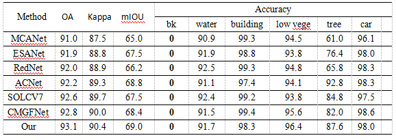

## 本周工作

RGB和DSM双流输入语义分割

对分割结果做蒸馏

a. rgb图像输入到image encoder，dsm图像作为mask prompt输入到prompt encoder，没训起来。

b. swin-transformer、mask2former做teacher model，效果很差。

c. 使用resnet152-resnet50做特征提取，过拟合。

d. CMGFNet做teacher model

