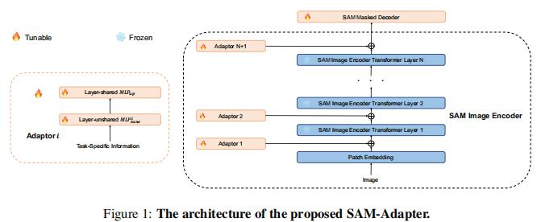
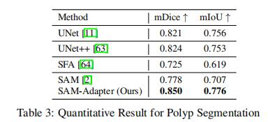
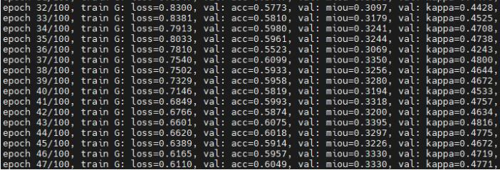
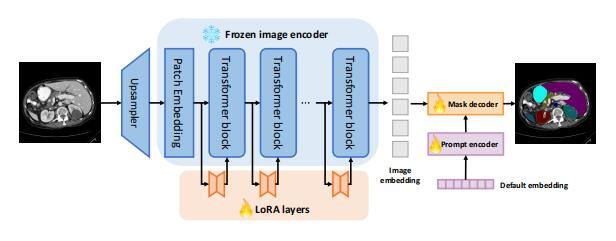
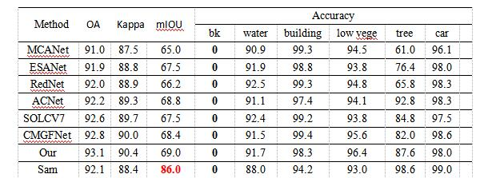

## 本周工作

Sam-Adaptor：

image_encoder每层有一个adapator，由两层MLP和激活函数组成，处理输入的image生成类似于prompt的中间提示，在image encoder每层的transfoemer使用。

UNet15年，UNet++18年，SFA19年

Samed：

LoRA先将每一层Transformer得到的特征进行压缩，然后在进行恢复(看源码是qkv，应该是注意力机制)

