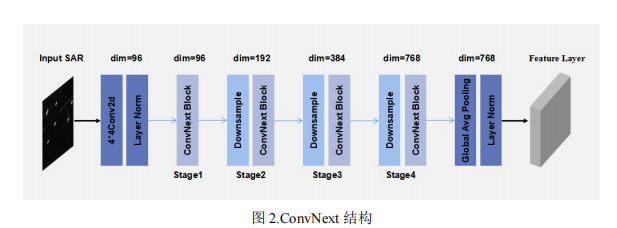

## 最近工作

1. 优化舰船检测方案

   之前特征提取方案：将Oriented论文的ResNet换成了ConvNext。

   

   现在特征提取的方案：两个ResNet结构，低层特征包含位置信息，高层特征包含特征信息，将前一个ResNet得到的高层特征传输给后面一个ResNet的低层，能够增加低层的特征信息。

   

   结果：

   

2. RGB和DSM双流输入语义分割

   最终的网络结构：

   

   结果如下：

   

   有些类别效果不是很好，我用ResNet152当作大模型做特征级的知识蒸馏，但是ResNet训出来过拟合，效果不行。后面准备用SegmentAnything大模型试一下。

   大模型当Teacher Model做知识蒸馏导致老师和学生模型参数量太大，看论文有人用相同的一个模型对不同波段的图像做特征提取，然后做知识蒸馏，Potsdam数据集还有一个红外波段，后面准备试一下。

   

   
