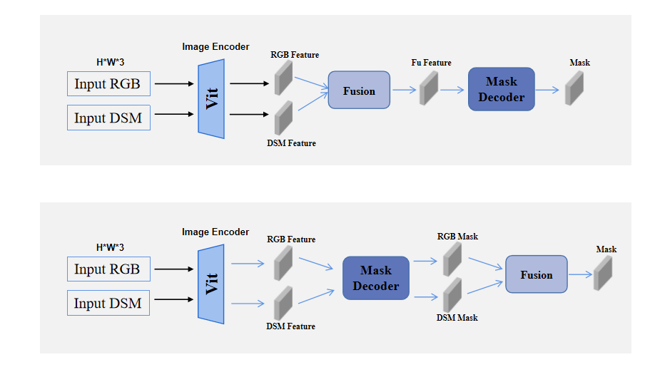
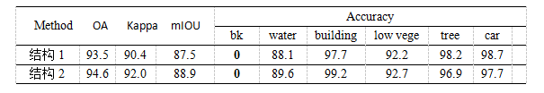
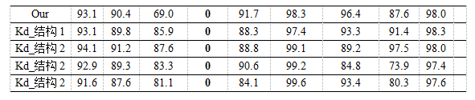
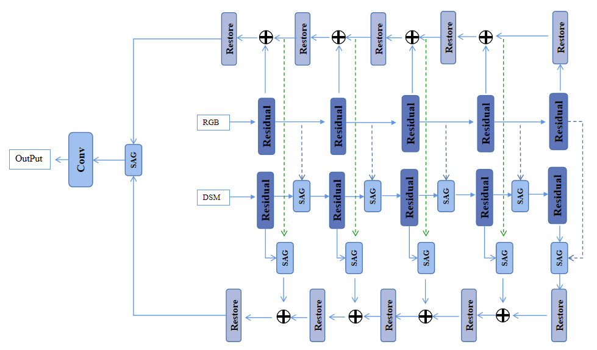

## 本周工作

修改了Sam_ed结构，RGB、DSM Feature在Encoder做蒸馏，RGB、DSM Mask在Decoder做蒸馏。

* 结果1：使用上面结构1的大模型做蒸馏
* 结果2：使用结构2的大模型，在encoder、decoder的双流中分别做蒸馏
* 结果3：使用结构2的大模型，在encoder的双流中做蒸馏
* 结果4：使用结构2的大模型，在decoder的双流中做蒸馏

