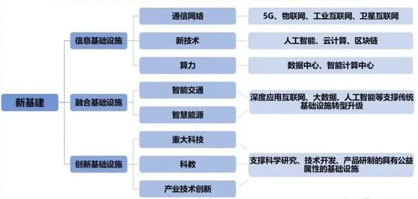

## 						新基建时代地球空间信息学的使命

​		随着全球数字化发展日益加快，时空信息、定位导航服务成为重要的新型基础设施，信息技术的快速发展催生了当前社会发展对新型基础设施的需求，新型基础设施建设时代依然到来。2018年12月，5G、人工智能、工业互联网、物联网纳入新基建范畴，2019年政府报告提出要加强和加快新一代信息基础设施建设，随着2021年首届北斗规模应用国际峰会的召开，新基建再次被提上日程。

* 新基建主要包括以下3个方面的内容：

​		

​		

​	

​																	 新基建与传统基建的不同

​		与传统基建相比，新基建内涵更加丰富，涵盖范围更广，更能体现数字经济特征，突出产业转型升级的新方向，推动中国经济转型升级。

​		地球空间信息学主要利用测绘、遥感和地理信息技术来获取、处理、分析和应用与地球空间位置有关的时空信息，为地球科学问题研究和对各行业全面精确服务提供技术方法和时空信息支撑。随着新基建时代的到来，我们需要更加丰富和完善的空间信息采集、处理和服务机制，解决数据的连接、交互和处理等问题，这赋予地球空间信息学新的使命。

### 地球空间信息学在信息基础设施中的使命

​		地球空间信息学既为数字孪生提供框架和地理底座，又是记录人车物和水电气候等万物活动时空大数据的手段，在信息基础设施中，至少完成以下使命。

  * **中国与全球的高精度时空基准**：以地球系统为中心逐步向太空发展，建立从牛顿力学到爱因斯坦相对论的天空地一体化的中国与全球高精度时空基准和四维时空框架。
  * **全国全球1:5万、各省1:1万三维测图**。
  * **全国实景三维城市底座和全国森林区激光点云三维模型**，与大气遥感和夜光遥感数据融合
  * **空间信息多级网格国情数据库**：针对建设100M * 100M数字网格化管理系统，为国家和省市宏观决策提供空间信息服务。
  * **制作全球每季度、中国每月的土地覆盖标准产品**：利用高分一号、高分六号光学卫星和高分三号雷达卫星，做到每月、每季度的多时相16M分辨率的地表覆盖制图。

### 地球空间信息学在融合基础设施中的使命

​		新基建时代，应运用时空大数据将物理空间静态和动态目标数字化，传输到网络空间，实现数字孪生，实现产业数字化和数字产业化，支持实体经济和数字经济双发展，主要有以下几个实现方向。

* **基于多时相三维实景影像的自然资源调查、生态环境检测与应急管理**：应结合深度神经网络对遥感影像进行自动分类与解译，以用于国土和自然资源调查、管理与检测，水土气生态环境检测，精准农业和灾害应急管理等。武汉大学龚健雅院士正在牵头研制开源的遥感影像样本库(LuoJiaSET)和遥感影像专用框架(LuoJiaNET)。
* **基于高精度时空大数据的公共安全与大健康产业**：对高精度时空大数据进行整理、挖掘、分析，以满足社会需求。建立“北斗+交通”智慧交通应急大脑系统，利用人们出行活动的所有轨迹数据解决交通拥堵问题。运用行为感知等技术记录人行为姿态、间隔，进行自动识别。
* **基于数字孪生的新型智慧城市、智慧交通、智慧能源**：在网络空间，再造一个与物理城市匹配的孪生城市，不断优化孪生城市，再作用于物理城市。
* **基于5G和人工智能的智能驾驶与机器人产业**：智能传感器应尽可能放在路上为所有车辆共享，车路协同感知认知应以200%的可靠性来实现无人驾驶和智能驾驶；除智能驾驶外，要研发能认路识路、导航定位的智能传感器，做能爬坡爬楼、水陆兼用的智能机器人。
* **通导遥一体化的空天信息实时智能服务**：要将遥感卫星、北斗卫星、通信卫星融合成一个畅通服务系统，构建全球数百颗卫星组成的天地一体化通信、导航、遥感多传感器加云计算和人工智能的天地互联网。

### 地球空间信息学在创新基础设施中的使命

* **“三深一系统”**：抓住深地、深海、深空以及地球系统，实现对天对地观测智能化，在太空开展导航定位、重力场研究等，积极主动参与天空竞争和对抗。
* **“三极”协同研究**：开展对南极、北极和青藏高原的协同研究，发射“三极”科学研究冰卫星，建立“三极”日地观测系统，建立“三极”地面无人值守观测网。

