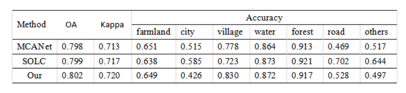
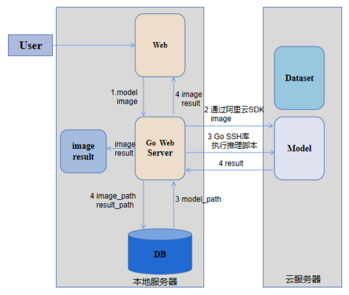

### 学期总结

* 2-3月：语义分割、高度估计比赛（最近这段时间我也在做，光学和SAR图像融合做语义分割）。
 

  

* 3-4月：做舰船检测实验，写论文。
 
* 5月、6月：写论文，着手准备平台的工作，先在本地实现了调用GEE，后面准备如何进行推理相关工作，初步设想就是把业务逻辑处理放在本地服务器上，模型相关放在云服务器上，现在先用实验室的服务器模拟云服务器。
 

  

